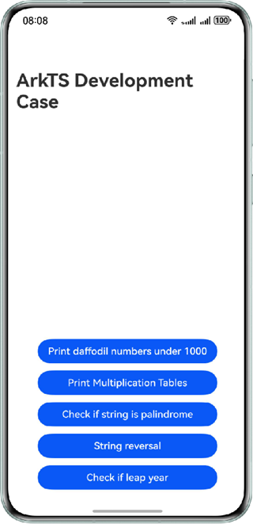

# ArkTS Development Cases

## Introduction

Learn how to use the ArkTS syntax to implement simple algorithms.

## Effect



### Project Directory

The following is an example of the key directory structure in the project:

```
├──entry/src/main/ets/
│  ├──common
│  │  ├──constants
│  │  │  └──Constants.ets                       // Constants
│  │  └──utils
│  │     ├──CommonUtils.ets                     // Dialog utilities
│  │     ├──Logger.ets                          //  Logger
│  │     └──Method.ets                          // Algorithm
│  ├──entryability
│  │  └──EntryAbility.ets  
│  ├──entrybackupability
│  │  └──EntryBackupAbility.ets 
│  ├──pages
│  │  └──Index.ets                              // Page implementation
│  └──view
│     ├──DaffodilsNumberCustomDialog.ets        // Dialog of daffodil numbers
│     ├──IsLeapYearCustomDialog.ets             // Dialog of leap year judgment
│     ├──IsPalindromicStringCustomDialog.ets    // Dialog of palindromic string judgment
│     ├──MultiplicationTableCustomDialog.ets    // Dialog of the nine-nine multiplication table
│     └──StringReversalCustomDialog.ets         // Dialog of string reversal
└───entry/src/main/resources                    // App resource directory
```

## Permissions

N/A

## How to Use

1. Tap the button for displaying a dialog box of the daffodil numbers within 1000.
2. Tap the button for printing the nine-nine multiplication table. A dialog box is displayed for you to view the table by logs.
3. Tap the button for determining a palindromic string. A dialog box is displayed, prompting you to enter a string.
4. Tap the button for string reversal. A dialog box is displayed, prompting you to enter a string.
5. Tap the button for determining a leap year. A dialog box is displayed, prompting you to enter a year.

## Constraints

1. The sample is only supported on Huawei phones with standard systems.

2. HarmonyOS: HarmonyOS 5.0.5 Release or later.

3. DevEco Studio: DevEco Studio 6.0.2 Release or later.

4. HarmonyOS SDK: HarmonyOS 6.0.2 Release SDK or later.
